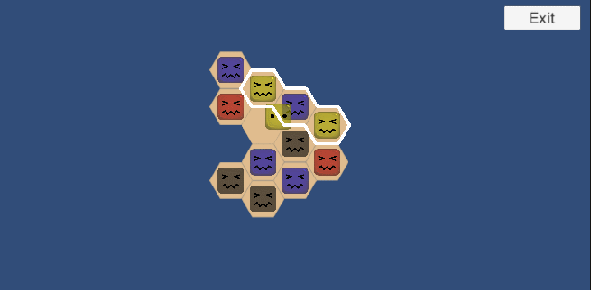
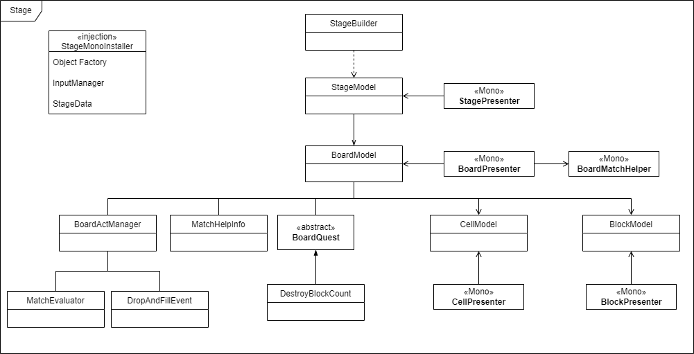
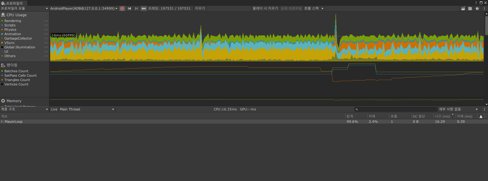
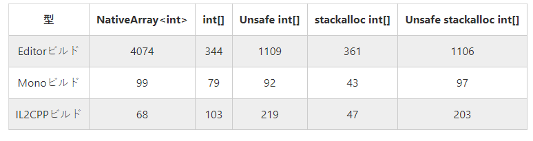
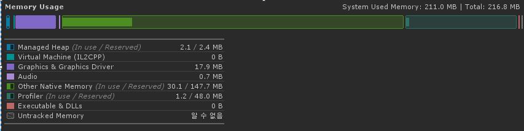
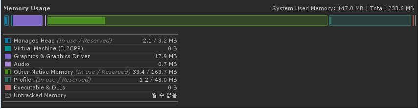

# SampleProject_HexPuzzle

### 1. 개요

-  소개 : Hex 형태의 3매치 퍼즐 기능 및 툴 개발
- 목적 : 샘플 코드 및 포트폴리오 제출
-  기간 : 1~2 주
-  개발 기능 
    - 라인 매치(세로, 대각선, 역대각선), Square 매치,
    - Drop & Fill Event
- 기타 효과 및 구성
    
- Detail

  - Unity 2020.3 사용

  - Reactive Programming을 위해 UniRx 사용

  - Dependency Injection을 위해 ZenJect 사용

  - MVP 패턴 중심으로 개발 진행

  - 추가 사용 패키지 : InputSystem

### 2. UML

- Stage 구성도
  - 종속, 참조, 상호참조 확인

### 3. Simulation

- 화면 전체를 채우는 보드를 구성 후 매치 및 파괴가 반복되는 환경 구성

- Match Test 및 Performance Test

- Test Device : LG G8

- Profile
  
  
  
  - Drop&Fill Table 구성시 18~20 Frame 까지 떨어졌으나 아래 내용 적용 후  30 Frame 이상 유지 중...
    - 반복 연산으로 인한 Overhead 최적화
      - Dictionary ContainKey -> TryGetValue
      - foreach -> for
      - data caching(loop count, get_property...)
      - 기타
    - SetActive 사용 최소화
      - Object를 비활성화 하기 보다는 화면 밖으로 이동시킴
    - Collider Issue
      - Object 이동시 굉장히 큰 Overhead 생성되므로 콜라이더 비활성화 후 재활성화
  
- Memory
  - Native Memory를 사용 중.
    
    - 원래 목적은 StackAlloc을 통해 Stack Base 자료구조 사용에 있었으나, Nuget Dll 이나 Unsafe Base의 Pointer를 사용하기 꺼려져 힙을 직접 관리하는 NativeArray를 사용.
    
    - IL2CPP Build 시 NativeArray가 StackAlloc 다음으로 접근이  빠르다. [#Ref](https://qiita.com/pCYSl5EDgo/items/2901604b72cbb2764940)
    
      
    
    - GC 호출 문제를 회피할 수 있으나 External Fragmantation 문제가 발생 할 수 있으므로 주의 필요.
    
  - Memory Profile
  
    - Stage 생성 후
  
      
  
    - 30분 경과
  
      - Native Memory 사용량이 3MB 정도 증가하였다.
  
      
  
  - NativeArray는 기능적으로 불편하고 대용량 메모리 사용 같은 특정 상황이 아닌 경우 크게 의미가 없어 보이므로 다음 프로젝트 진행시에는 잡 시스템 사용을 제외하면 사용하지 않을 생각.

